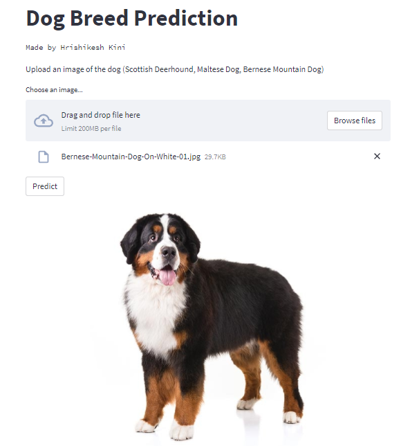
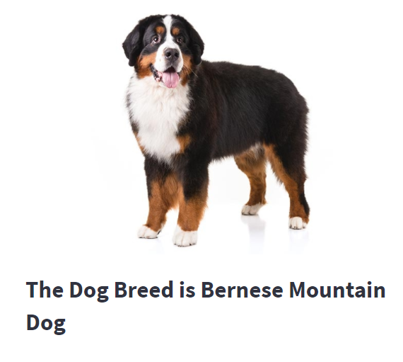

# Dog Breed Prediction
The main goal of this project is to predict the breeds of different dogs available in the provided dataset.

## Table of Content
  * [Demo](#demo)
  * [Problem Statement](#problem-statement)
  * [Approach](#approach)
  * [Technologies Used](#technologies-used)
  * [Installation](#installation)
  * [Deployement on Heroku](#deployement-on-heroku)
  * [Detailed Project Reports](#detailed-project-reports)
  * [Bugs & Logs](#bugs--logs)
  * [Contributors](#contributors)

## Demo
Link: [https://dogbreedprediction.herokuapp.com/](https://dogbreedprediction.herokuapp.com/)




## Technologies Used
 
   1. Python 
   2. Sklearn
   3. Tensorflow
   4. Keras
   5. Opencv

## Installation
Click here to install [python](https://www.python.org/downloads/). To install the required packages and libraries, run this pip command in the project directory after cloning the repository:
```bash
git clone https://github.com/jpkelvin/Flight_Fare_Prediction.git
pip install -r requirements.txt
```
If pip is not already installed, Follow this [link](https://pip.pypa.io/en/stable/installation/)


## Bugs & Logs

1. If you find a bug, kindly open an issue and it will be addressed as early as possible. [Open](https://github.com/jpkelvin/Flight_Fare_Prediction/issues)
2. Under localhost, logging is performed for all the actions and its stored onto logs.txt file

## Contributors
1. [rishikesh Kini](https://github.com/hrishikeshkini)
